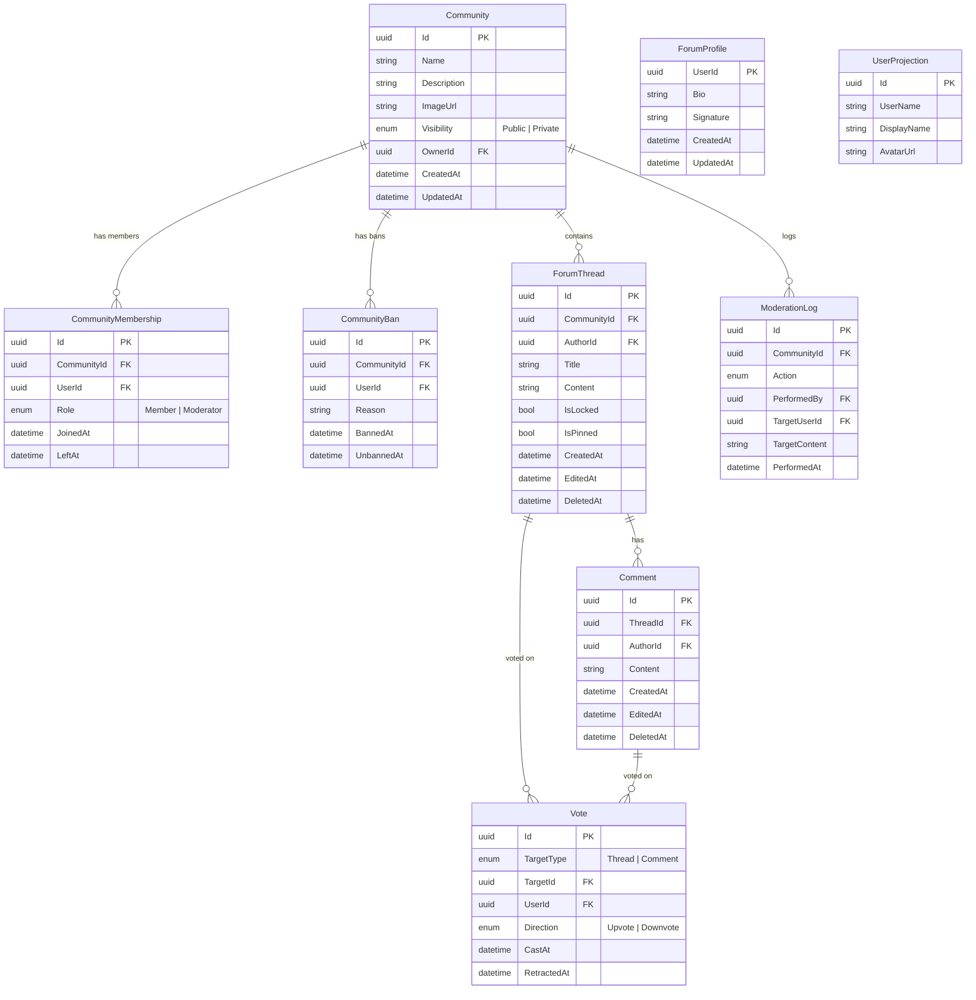

# Domain Model — Forum

## ERD

## Aggregates & Invariants

### Community
| Invariant | Where enforced |
|---|---|
| Name cannot be empty | `Community.Create` / `Update` |

### ForumThread
| Invariant | Where enforced |
|---|---|
| Title cannot be empty | `ForumThread.Create` / `Edit` |
| Cannot edit deleted thread | `ForumThread.Edit` |
| Cannot edit locked thread | `ForumThread.Edit` |
| Cannot delete already deleted thread | `ForumThread.Delete` |
| Cannot lock already locked thread | `ForumThread.Lock` |
| Cannot pin already pinned thread | `ForumThread.Pin` |
| Spam check before create/edit | `ThreadWorkflowManager` via `ISpamDetectionEngine` |

### Comment
| Invariant | Where enforced |
|---|---|
| Content cannot be empty | `Comment.Create` / `Edit` |
| Cannot edit deleted comment | `Comment.Edit` |
| Cannot delete already deleted comment | `Comment.Delete` |
| Spam check before create/edit | `CommentWorkflowManager` via `ISpamDetectionEngine` |

### Vote
| Invariant | Where enforced |
|---|---|
| Cannot retract already retracted vote | `Vote.Retract` |
| Cannot switch to same direction | `Vote.SwitchDirection` |
| CastAsync is upsert: switches direction if different | `VoteManager.CastAsync` |

### CommunityMembership
| Invariant | Where enforced |
|---|---|
| Cannot leave already-left membership | `CommunityMembership.Leave` |
| Cannot appoint already-moderator | `CommunityMembership.AppointModerator` |
| Cannot remove moderator role from non-moderator | `CommunityMembership.RemoveModerator` |

### CommunityBan
| Invariant | Where enforced |
|---|---|
| Cannot unban already unbanned | `CommunityBan.Unban` |

### ForumProfile
| Invariant | Where enforced |
|---|---|
| Bio ≤ 500 characters | `ForumProfile.Validate` |
| Signature ≤ 200 characters | `ForumProfile.Validate` |
| Whitespace-only values normalised to `null` | `ForumProfile.Normalize` |

## Domain Engines

| Engine | Location | Purpose |
|---|---|---|
| `ISpamDetectionEngine` | `Domain/Engines` | Rejects content flagged as spam before thread/comment creation or edits |
| `IHotRankingEngine` | `Domain/Engines` | Calculates a hot-score for threads based on age, vote score, and comment count |

## Domain Events

| Event | Raised by |
|---|---|
| `CommunityCreated` | `Community.Create` |
| `CommunityUpdated` | `Community.Update` |
| `CommunityDeleted` | `Community.Delete` |
| `CommunityOwnershipTransferred` | `Community.TransferOwnership` |
| `MembershipJoined` | `CommunityMembership.Create` |
| `MembershipLeft` | `CommunityMembership.Leave` |
| `ModeratorAppointed` | `CommunityMembership.AppointModerator` |
| `ModeratorRemoved` | `CommunityMembership.RemoveModerator` |
| `UserBanned` | `CommunityBan.Create` |
| `UserUnbanned` | `CommunityBan.Unban` |
| `ThreadCreated` | `ForumThread.Create` |
| `ThreadEdited` | `ForumThread.Edit` |
| `ThreadDeleted` | `ForumThread.Delete` |
| `ThreadLocked` | `ForumThread.Lock` |
| `ThreadPinned` | `ForumThread.Pin` |
| `CommentCreated` | `Comment.Create` |
| `CommentEdited` | `Comment.Edit` |
| `CommentDeleted` | `Comment.Delete` |
| `VoteCast` | `Vote.Create` |
| `VoteSwitched` | `Vote.SwitchDirection` |
| `VoteRetracted` | `Vote.Retract` |
| `ForumProfileUpdated` | `ForumProfile.Create` / `Update` |
| `ModerationActionLogged` | `ModerationLog.Create` |
