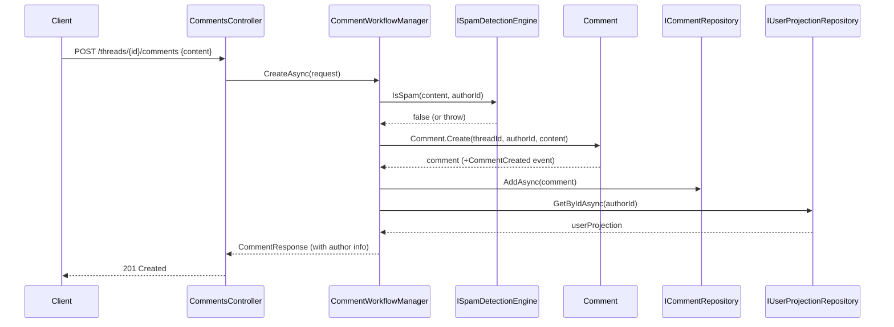
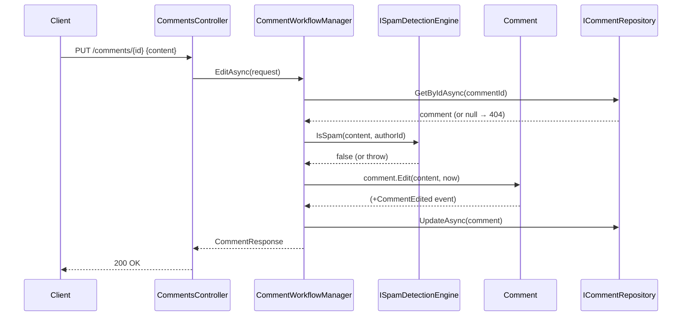

# Use Case: Comment Lifecycle

**Manager:** `CommentWorkflowManager`  
**Engines used:** `ISpamDetectionEngine`

---

## Create Comment

**Actor:** Authenticated user  
**Entry point:** `POST /threads/{id}/comments`

---

## Edit Comment

**Entry point:** `PUT /comments/{id}`

---

## Delete Comment

**Entry point:** `DELETE /comments/{id}`

Same pattern: `GetByIdAsync` → `comment.Delete(now)` → `UpdateAsync`.

## Guard failures

| Guard | Error |
|---|---|
| Content flagged as spam | `InvalidOperationException` |
| Content empty | `ArgumentException` |
| Edit on deleted comment | `InvalidOperationException` |
| Delete already deleted | `InvalidOperationException` |
