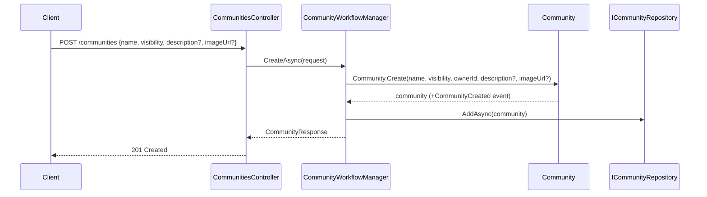
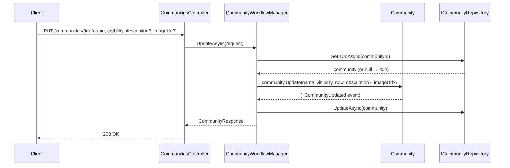
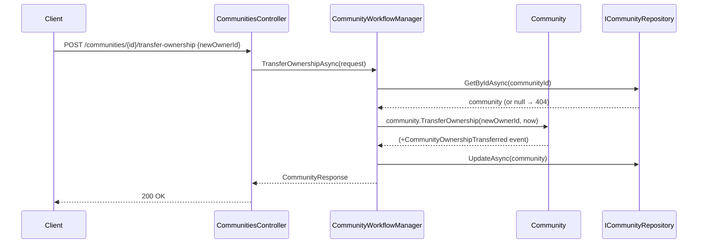

# Use Case: Community Lifecycle

**Manager:** `CommunityWorkflowManager`

---

## Create Community

**Actor:** Authenticated user  
**Entry point:** `POST /communities`

---

## Update Community

**Entry point:** `PUT /communities/{id}`

---

## Transfer Ownership

**Entry point:** `POST /communities/{id}/transfer-ownership`

## Guard failures

| Guard | Error |
|---|---|
| Name empty | `ArgumentException` |
