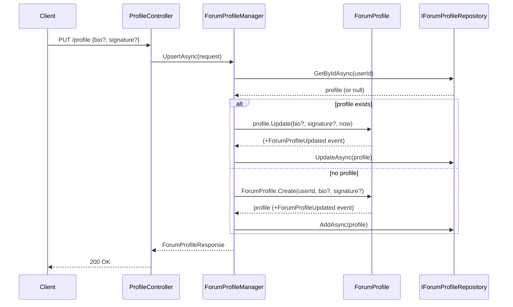

# Use Case: Forum Profile

**Manager:** `ForumProfileManager`

Each user has at most one `ForumProfile`. The upsert pattern is used: create on first update, update thereafter.

---

## Create / Update Profile

**Actor:** Authenticated user  
**Entry point:** `PUT /profile`

## Guard failures

| Guard | Error |
|---|---|
| Bio > 500 characters | `ArgumentException` |
| Signature > 200 characters | `ArgumentException` |
