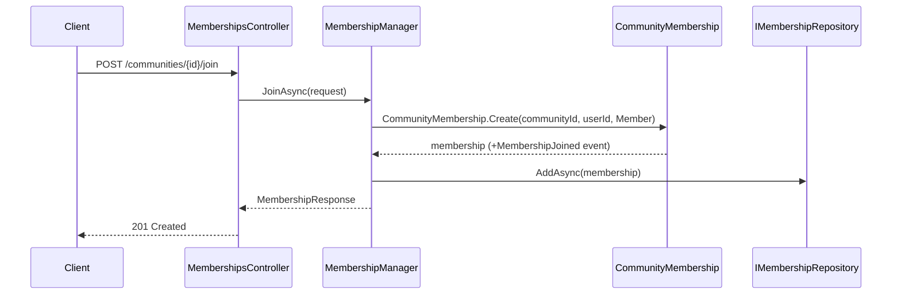
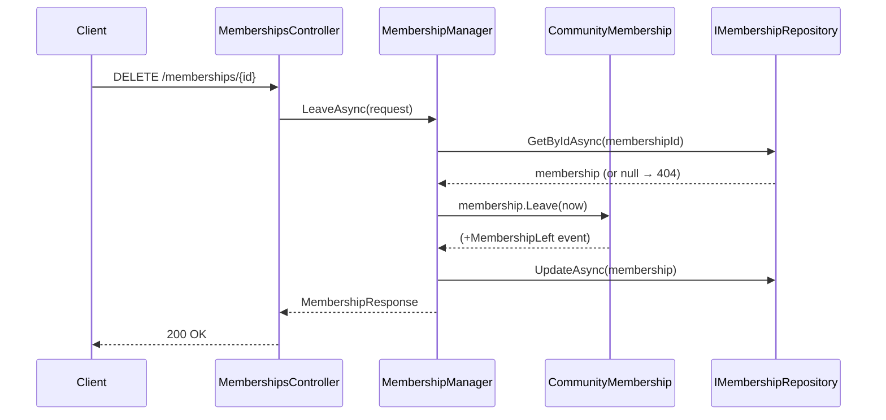

# Use Case: Community Membership

**Manager:** `MembershipManager`

---

## Join Community

**Actor:** Authenticated user  
**Entry point:** `POST /communities/{id}/join`

---

## Leave Community

**Entry point:** `DELETE /memberships/{id}`

---

## Appoint / Remove Moderator

Both follow `GetByIdAsync` → domain method → `UpdateAsync`.

| Operation | Entry point | Domain method | Event |
|---|---|---|---|
| Appoint mod | `POST /memberships/{id}/moderator` | `membership.AppointModerator(now)` | `ModeratorAppointed` |
| Remove mod | `DELETE /memberships/{id}/moderator` | `membership.RemoveModerator(now)` | `ModeratorRemoved` |

## Guard failures

| Guard | Error |
|---|---|
| Leave already-left membership | `InvalidOperationException` |
| Appoint already-moderator | `InvalidOperationException` |
| Remove moderator from non-moderator | `InvalidOperationException` |
