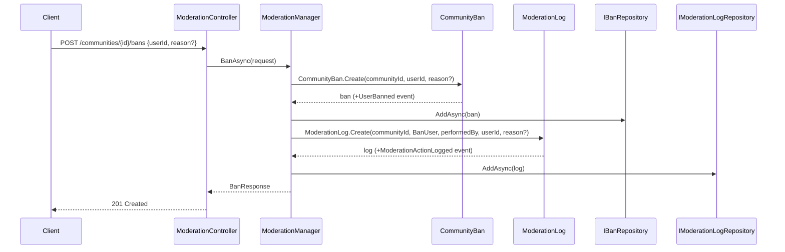
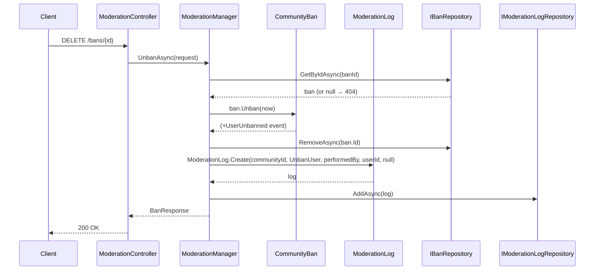
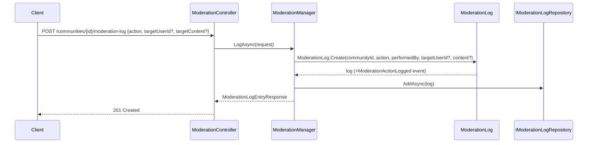

# Use Case: Moderation

**Manager:** `ModerationManager`

---

## Ban User

**Actor:** Community moderator or owner  
**Entry point:** `POST /communities/{id}/bans`

---

## Unban User

**Entry point:** `DELETE /bans/{id}`

---

## Log Moderation Action

**Entry point:** `POST /communities/{id}/moderation-log`  
Used to record free-form moderation actions (e.g. thread removal, content warning).

## Guard failures

| Guard | Error |
|---|---|
| Unban already unbanned | `InvalidOperationException` |
