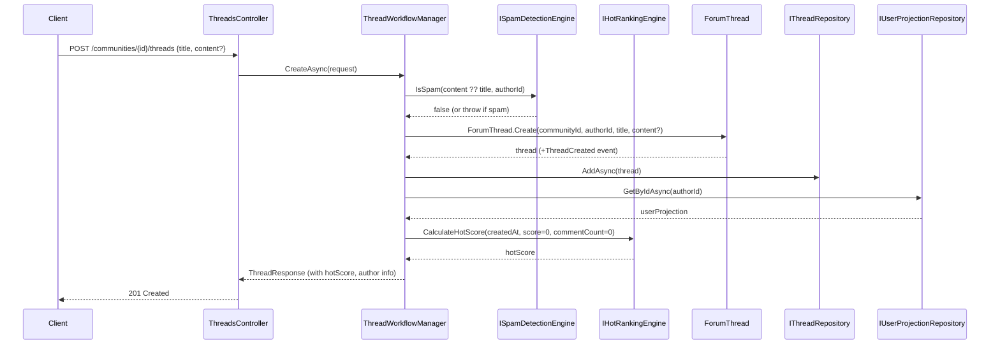
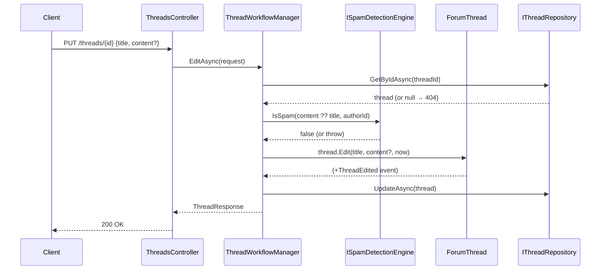

# Use Case: Thread Lifecycle

**Manager:** `ThreadWorkflowManager`  
**Engines used:** `ISpamDetectionEngine`, `IHotRankingEngine`

---

## Create Thread

**Actor:** Authenticated community member  
**Entry point:** `POST /communities/{id}/threads`

---

## Edit Thread

**Entry point:** `PUT /threads/{id}`

---

## Delete / Lock / Pin Thread

All follow the same pattern: `GetByIdAsync` → domain method → `UpdateAsync`.

| Operation | Entry point | Domain method | Event |
|---|---|---|---|
| Delete | `DELETE /threads/{id}` | `thread.Delete(now)` | `ThreadDeleted` |
| Lock | `POST /threads/{id}/lock` | `thread.Lock(now)` | `ThreadLocked` |
| Pin | `POST /threads/{id}/pin` | `thread.Pin(now)` | `ThreadPinned` |

## Guard failures

| Guard | Error |
|---|---|
| Content flagged as spam | `InvalidOperationException` |
| Title empty | `ArgumentException` |
| Edit on deleted thread | `InvalidOperationException` |
| Edit on locked thread | `InvalidOperationException` |
| Delete already deleted | `InvalidOperationException` |
| Lock already locked | `InvalidOperationException` |
| Pin already pinned | `InvalidOperationException` |
