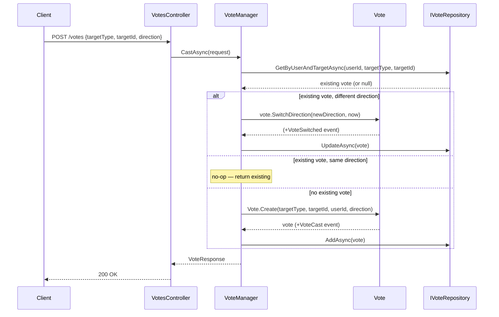
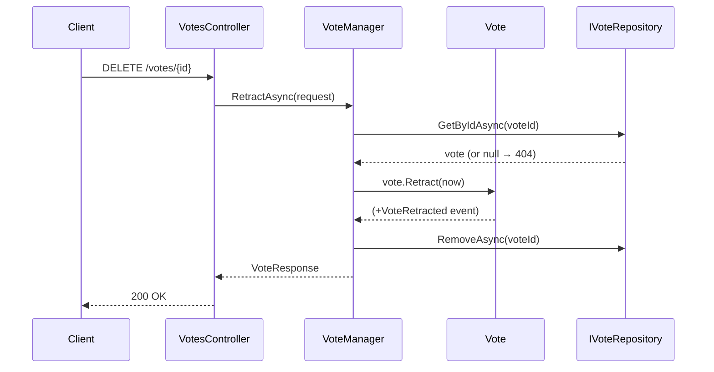

# Use Case: Voting

**Manager:** `VoteManager`

Votes target either a `Thread` or a `Comment` (`VoteTargetType`). Casting is an upsert — re-voting with a different direction switches; re-voting with the same direction is a no-op.

---

## Cast Vote (upsert)

**Actor:** Authenticated user  
**Entry point:** `POST /votes`

---

## Retract Vote

**Entry point:** `DELETE /votes/{id}`

## Guard failures

| Guard | Error |
|---|---|
| Switch to same direction | `InvalidOperationException` |
| Retract already retracted vote | `InvalidOperationException` |
